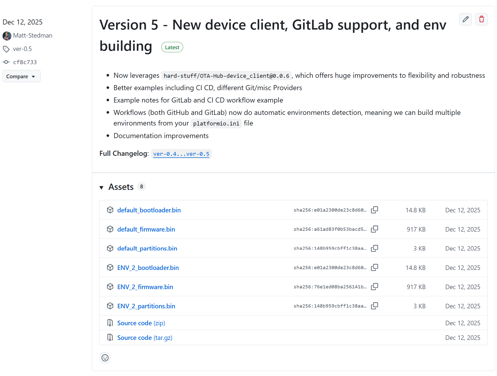

# **OTA-Hub (by Hard Stuff)** - Over the Air Firmware Updates directly from GitHub, GitLab, and more!

OTA-Hub for ESP32 allows firmware updates over the air directly from GitHub, GitLab, and other cloud build providers. Quick and easy OTA, for free! 

[](https://registry.platformio.org/libraries/hard-stuff/OTA-Hub-device_client)
[](https://github.com/Hard-Stuff/OTA-Hub-examples-github_project/wiki)
[](https://github.com/Hard-Stuff/OTA-Hub-device_client/stargazers)


** This piolib works with GitHub repos,**

** GitLab repos,**

** and you can even self-host with our Docker image!**

**OTA-Hub** is a solution to enable building and hosting your firmware updates on Git (Hub or Lab) and accessing them simply on your ESP devices. That's this repo, and it's entirely open source.

**OTA-Hub Cloud** _(coming soon)_ is a cloud software that builds on that by enabling per-device provisioning, and data endpoints to plug into your stack. Think AWS IoT Core but massively simplified - great for hobbyists, prototyping, and startups. OTA-Hub Cloud comes in both free and paid tiers.

Find out more about this and our other open source projects and products at [ota-hub.com](www.ota-hub.com). OTA Hub is brought you to by [Hard Stuff](www.hard-stuff.com) in London, UK.

## Why?

At the risk of repeating ourselves - we answer this in [our example project](https://github.com/Hard-Stuff/OTA-Hub-example_project/tree/main?tab=readme-ov-file#why) and at [ota-hub.com](www.ota-hub.com).
  
**But, in short:**

1. You can use GitHub/GitLab as your build engine and storage solution for your `.bin` firmware files, obviously in the same place as your actual code.
2. That means it's cheaper (free), easier, more obvious, and simpler to track what code is where.
3. You're not married to any one platform/solution - easy to drop in, but easy to drop out and upscale when needed!
4. This works for any Public and your Private Git repos.
5. It's incredibly flexible - on top of GitHub, GitLab, and OTA-Hub Cloud, you can leverage this library with many other build providers, and we're implementing more soon!
6. It works on any abstract HTTP client, meaning `WiFi`, `WiFiClientSecure`, `TinyGSM` (4G/5G), even `LTEm/NBIoT modems`.

## Git release usage

The OTA process can now be simplified to:
1. Have your firmware code hosted on GitHub/GitLab - we build our firmware in `platformio` projects.
2. Use Git's CI/CD to build that firmware into releasable `.bin` files hosted there - we have drop in examples here.
3. Your firmware would have OTA Hub Device Client running, and you check for a new release e.g. on boot. This finds the latest release, and based on your logic (see below) downloads and flashes it.
4. _That is it.. it's that simple!_

   

## Usage

_You must first have CI/CD set up on your firmware repo of choice. Follow or clone [the example project](https://github.com/Hard-Stuff/OTA-Hub-example_project) for a simple copy-paste guide on how to do this._

The flow logic for this entire OTA library is super simple:

1. **Check for updates** - It first checks on your GitHub repo for the latest release of your firmware. GitHub reports back the `name` and `published_at` timestamp of the latest **release**.
2. **Perform the update** - If given the information in step 1 compared to the current installation you want to perform the update: automatically download and install the `firmware.bin` file onto the device.
3. **Follow the redirect to download (this happens internally)** - Because GitHub hosts the release data on `api.github.com` but the `firmware.bin` asset on `objects.githubusercontent.com` - no action is needed on your part!

### Basic Example

```cpp
#include <Arduino.h>

// OTA Hub via GitHub
#include <OTA-Hub.hpp>
#include <OTA-Hub/FOTA-providers/github.hpp> // Only needed for github

#include <WiFiClientSecure.h>

WiFiClientSecure wifi_client;
OTAHub::FOTA::GithubProvider provider(
    "Hard-Stuff",
    "OTA-Hub-example_project"); // Assumed a public repo

void setup()
{
  Serial.begin(115200);
  Serial.println("Started...");

  WiFi.begin("Your SSID", "Your PASS");
  if (WiFi.waitForConnectResult() != WL_CONNECTED)
  {
    Serial.println("WiFi failure");
    ESP.restart();
  }

  // Initialise OTA
  wifi_client.setCACert(OTAHub::certs::GITHUB_CA); // Need to set this prior to init because you can use any (un)secure client, not just WiFiClientSecure!
  OTAHub::FOTA::init(wifi_client, provider);

  // Check OTA for updates
  OTAHub::FOTA::UpdateObject details = OTAHub::FOTA::isUpdateAvailable();
  details.print(); // Optionally print to Serial.

  Serial.println(OTAHub::FOTA::ota_provider->FIRMWARE_WAS_BUILT_ON_PROVIDER
                     ? "This was built on Git."
                     : "This was built locally."); // Useful if you want to prioritise locally built code.

  if (OTAHub::FOTA::NO_UPDATE != details.condition)
  {
    Serial.println("An update is available!");
    // Perform OTA update - will auto restart
    if (OTAHub::FOTA::performUpdate(&details) != OTAHub::FOTA::SUCCESS)
      // Something is wrong... Do something
      Serial.println("Failed to download / install. Bother...")
  }
  else
    Serial.println("No new update available. Continuing...");

  // As normal
}

void loop()
{
  // As normal
}
```

## Providers

###  GitHub

```cpp
#include <OTA-Hub/FOTA-providers/github.hpp>
...
OTAHub::FOTA::GithubProvider provider(
    "Hard-Stuff",               // The organisation / user
    "private_repo",             // The repo name, can be publice or private (in this case it's a private repo)
    // below are optional:
    "custom_firmware_name.bin", // The custom firmware string to match - useful if you have multiple firmware builds
    true                        // Needed to load the GitHub bearer token (only for private repo) from NVS.
    );
```

###  GitLab

```cpp
#include <OTA-Hub/FOTA-providers/gitlab.hpp>
...
OTAHub::FOTA::GitlabProvider provider(
    123...123,                       // The project id, can be public or private
    // below are optional:
    "a_different_firmware_name.bin", // as above..
    true                             // as above.. (only for private repo)
    );
```

###  Docker (self hosted)

_coming soon!_

### Custom (dev your own!)

- See our guide on [./docs/custom-providers.md](./docs/custom-providers.md) _(docs upgrade coming soon!)_

_\* Note that our default examples are for SSL-enabled connections, as GitHub requires a secure connection. As this is open-source, you can of course use your own storage buckets APIs for insecure connections etc._

## Private repositories

OTA Hub DIY works with both your public and private repositories, pulling release files (that are automatically compiled) directly from GitHub. Follow the same process as decribed in [our example project for this](https://github.com/Hard-Stuff/OTA-Hub-example_project/blob/main/docs/private-repositories.md).

- Make a personal access token on GitHub/GitLab
- Follow the above to add it ONCE to your ESP32's Non Volatile Storage (NVS) on first flash (because you'll have USB access the first time..)
- Future OTA checks will use the PAT in your NVS, so you should never need to ship your PAT in the Build _(e.g. as a `#define` as we've seen others do...)_

## Library notes

### Dependencies

-   arduino-libraries/ArduinoHttpClient
-   bblanchon/ArduinoJson
-   paulstoffregen/Time
-   [hard-stuff/Http](https://registry.platformio.org/libraries/hard-stuff/Http)

### Note on CA Certs

- We've bundled a few GitHub and GitLab CA certs together to cover both's various HTTP reroutings.
- **Certificates expire!** Though they tend to last a while - these ones last until 2030 - it's something to be aware of. Once either certificate has expired your devices will not be able to perform OTA (until flashed with new certs) - this is something we're going to attempt to future-proof going forwards.
- Plus, as we've experienced recently, certificates that are in date [might just stop working](https://news.ycombinator.com/item?id=35295216). In which case it's not a bad idea to either have a fallback option (we recommend [ElegantOTA](https://github.com/ayushsharma82/ElegantOTA) for local flashing) or to watch this space for our future proofing.
- You can always set your own certs (should the default ones not work) via `wifi_client.setCACert(NEW CA CERT)` and `wifi_client.setCACert(NEW CA CERT)`.
- Or you can set `wifi_client.setInsecure()` and remove the `setCACerts...`. This means that the ESP32 will not validate if the api.github.com and objects.githubusercontent.com have the correct CA Certs, so could technically open up security issues (although for hobbyist / non-critical projects this should be fine). 

### Compatibility

This library has been tested on the ESP32S3 with both the internal WiFi functionality and a [SIMCOM SIM7600G](https://github.com/Hard-Stuff/TinyGSM), both with HTTP and HTTPS connections, both with GitHub and GitLab, and both on public and private repositories.

We are looking for people to support us in testing more boards, other connectivity functionalities, and making **OTA Hub Pro** even more useful.

## Contribution

We're looking for people to work with us further on this - you can get started with issue reports or merge rquests, or you can contact us at [ota-hub@hard-stuff.com](mailto:ota-hub@hard-stuff.com).

## Hard Stuff

Hard Stuff is a hardware prototyping agency and venture studio focussing on sustainability tech, based in London, UK.
Find out more at [hard-stuff.com](hard-stuff.com).

This library is written and provided open-source in the hope that you go on to build great things.
